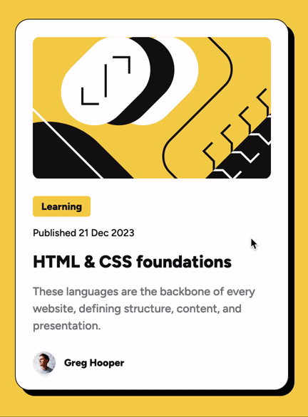

# Frontend Mentor - Blog preview card solution

This is a solution to the [Blog preview card challenge on Frontend Mentor](https://www.frontendmentor.io/challenges/blog-preview-card-ckPaj01IcS). Frontend Mentor challenges help you improve your coding skills by building realistic projects.

## Table of contents

-   [Overview](#overview)
    -   [The challenge](#the-challenge)
    -   [Screenshot](#screenshot)
    -   [Links](#links)
-   [My process](#my-process)
    -   [Built with](#built-with)
    -   [What I learned](#what-i-learned)
    -   [Continued development](#continued-development)
    -   [Useful resources](#useful-resources)
-   [Author](#author)

## Overview

### The challenge

Users should be able to:

-   See hover and focus states for all interactive elements on the page

### Screenshot

### Links

-   Solution URL: <https://github.com/gdsimoes/blog-preview-card>
-   Live Site URL: <https://gdsimoes.github.io/blog-preview-card/>

## My process

### Built with

-   Semantic HTML5 markup
-   CSS custom properties
-   Mobile-first workflow

### What I learned

This is my first Frontend Mentor project in a while and I was focusing mostly on improving my workflow and getting comfortable with some tools. I used a lot of GitHub features, tried to become more comfortable with Figma (including the VS Code extension) and learned how to use `FFmpeg` to create a GIF from a video.

### Continued development

Since I did this project mostly to review and practice I refrained from using Flexbox, Grid and other advanced CSS features or JavaScript. For the next few projects I plan to increase the number of features and technologies I use.

### Useful resources

-   [Learning Git](https://www.oreilly.com/library/view/learning-git/9781098133900/) - This book helped me become proficient in Git.
-   [How to convert video to animated GIF using FFmpeg](https://shotstack.io/learn/convert-video-gif-ffmpeg/) - This is a great article that not only gave the right commands to do what I wanted but explained in simple terms every single step.

## Author

-   Website - <https://gdsimoes.com>
-   Frontend Mentor - [gdsimoes](https://www.frontendmentor.io/profile/gdsimoes)
-   LinkedIn - [gdsimoes](https://www.linkedin.com/in/gdsimoes)
